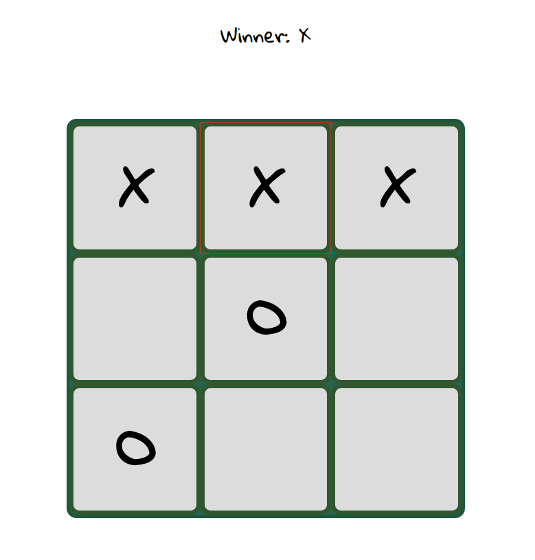

# Tic Tac Toe
A simple tic tac toe that I made to learn React going thorugh the [tutorial](https://reactjs.org/tutorial/tutorial.html).



### Instructions
1. Clone this repository of download zip.
2. Go into the repository directory and open terminal.
3. Install required node modules.
    ```javascript
    npm install
    ```
4. Start node server.
    ```javascript
    npm start
    ```
5. Open browser, check <i>http://localhost:3000</i>.
